# JB03
<!DOCTYPE html>
<html>
<head>
	<meta charset="utf-8">
	<title>만원의 행복</title><meta charset="utf-8">
	<link href="https://fonts.googleapis.com/css?family=Stylish" rel="stylesheet">
    
</head>
<body>

<h1>안산시 공공자전거</h1>

	
<h2>페달로란?</h2>

누구나,언제나,어디서나 쉽고 편리하게 이용할 수 있는 공공자전거 무인대여시스템으로, 
안산시의 대기오염, 고유가 문제를 해결하고 건강한 사회 및 시민들의 삶의 질을 높이고자 마련되었습니다.

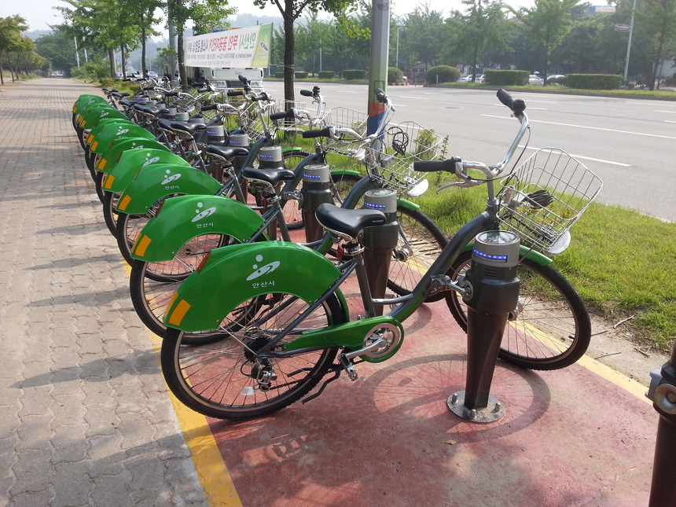
<h2>페달로 자전거</h2>

페달로 자전거는 여성 및 노약자 누구나 편하게 승,하차 할 수 있는 자전거로 
안산시 전역 어디든지 쉽고 편리하게 주행할 수 있습니다.

<h2>페달로 키오스크</h2>

페달로정거장은 안산시 총 101곳에 설치되어 운영하고 있으며, 자전거의 대여/반납이 무인으로 이루어지는 공간으로
키오스크를 통하여 주변 정거장 정보를 확인할 수 있습니다.

<h2>페달로 보관대</h2>

터미널에 설치된 자전거 보관대는 자전거의 잠금 및 도난 방지를 위한 자전거 잠금장치가 부착되어 있습니다.
보관대는 회원카드 및 자전거 식별장치가 부착되어 있어 쉽고 빠르게 자전거를 대여/반납 할 수 있습니다.

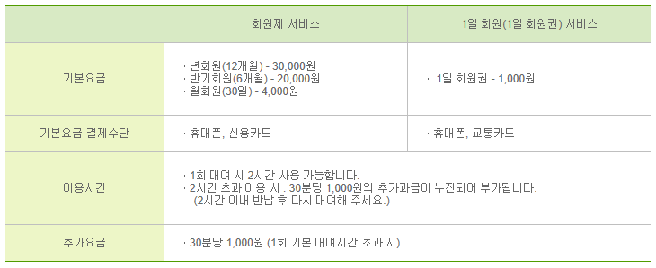
<h2>가격구성</h2>

<h1>홈페이지 분석</h1>

 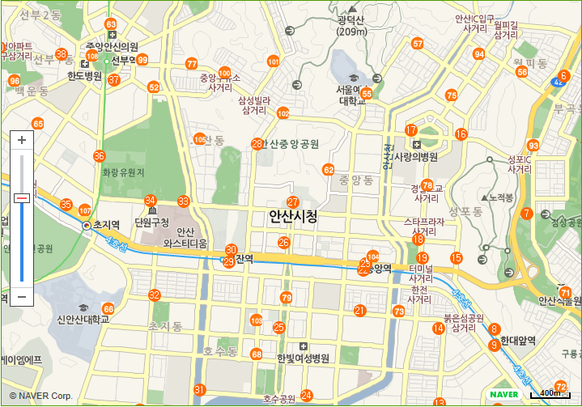

안산시에 있는  모든 정거장의 위치와 대여 가능한 자전거의 실시간 현황을 한눈에 볼 수 있습니다.
정거장 아이콘, 정거장명을 클릭하면 대여 가능한 자전거 댓수, 반납 가능한 거치대 수량 및 대한 정보를 확인할 수 있습니다.
자전거 도로로 들어가면 서로 다른 매력의 라이딩을 즐길 수 있는 다양한 코스가 나옵니다.

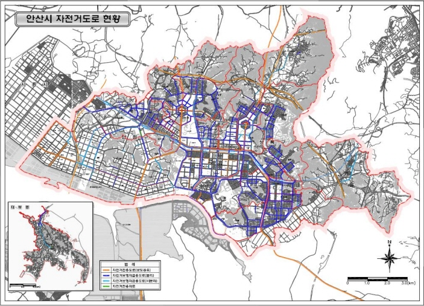

안산시 자전거 전용도로

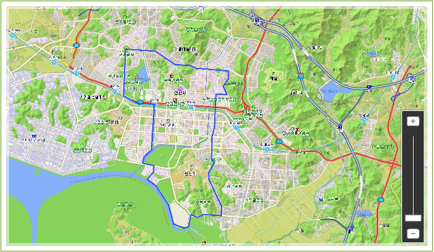

가족 하이킹 코스

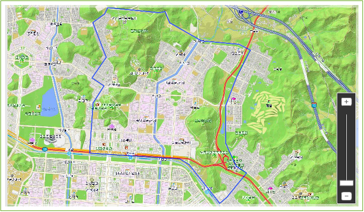

역사 문화 탐방

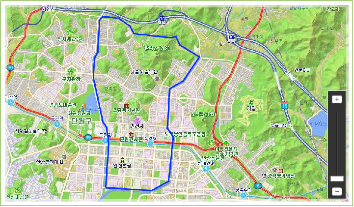

하천 자연 학습

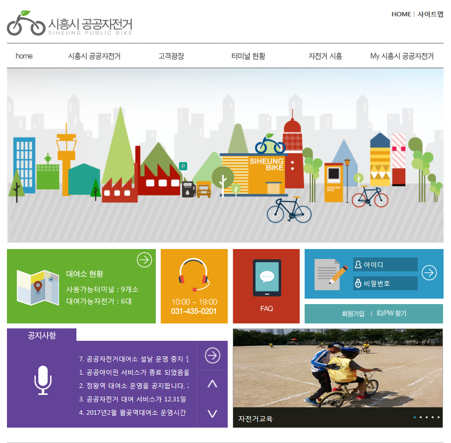
<h2>시흥시 홈페이지</h2>
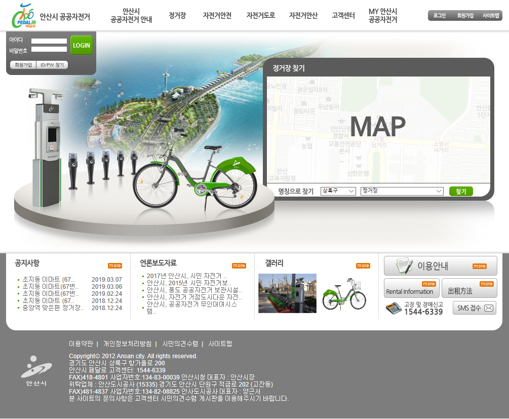
<h2>안산시 홈페이지</h2>

시흥시 홈페이지는 카드형으로 디자인 되어있어 안산시보다 시각적으로 더 정돈되었고 한눈에 알아보기 쉬웠습니다 

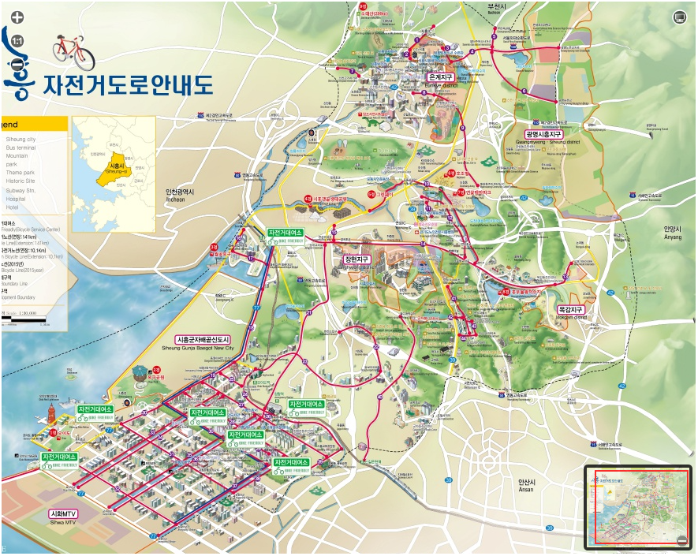
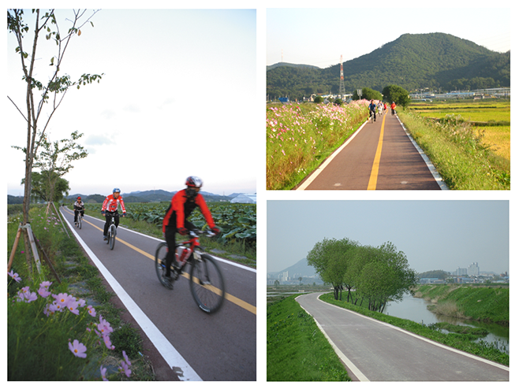

시흥시는 안산시처럼 자전거 도로 지도가 있었지만 라이딩 코스가 따로 없었습니다.
대신 시흥시는 포토갤러리에서 시흥시의 아름다운 풍경사진을 볼 수 있게 해놓았습니다.
안산시의 코스마다 계절마다 아름다운 풍경사진을 게시한다면 더 많은 사람들이 사람들이 이용할 것 같습니다.

</body>
</html>>
